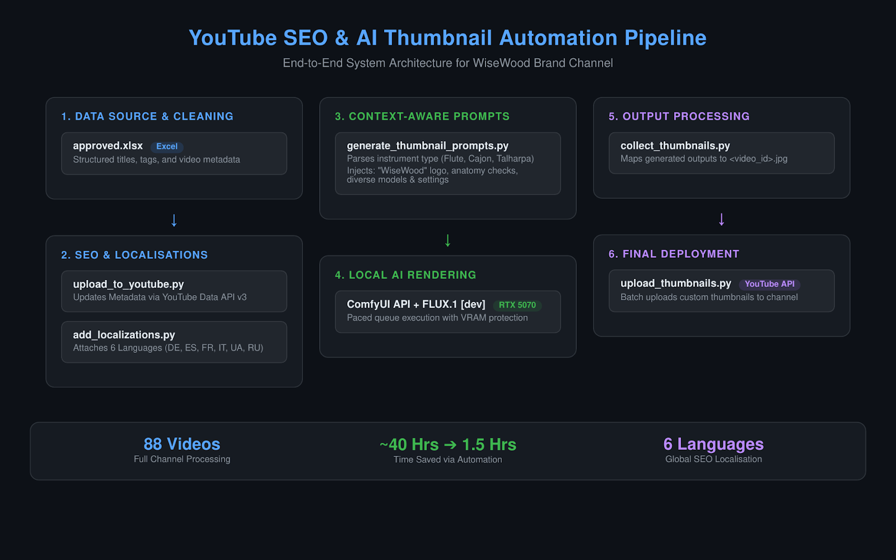

# YouTube SEO & Thumbnail Automation Engine

A Python-based workflow for batch-optimising a YouTube channel (specifically for the **WiseWood** musical instrument brand). It handles metadata cleaning, multi-language localization via the YouTube API, and local AI thumbnail generation using FLUX.1.

## 📐 System Architecture



## 🛠 Tech Stack

* **Language:** Python 3.10+
* **Data Processing:** Pandas, OpenPyXL
* **API Integration:** YouTube Data API v3 (`google-api-python-client`, OAuth 2.0)
* **AI Image Generation:** ComfyUI API, FLUX.1 [dev], PyTorch (CUDA)

## 💡 What Problem This Solves

Updating 88 videos manually—translating metadata across 6 languages and custom-designing cohesive thumbnails—takes roughly 35 to 40 hours of tedious admin. This pipeline reduces execution time to ~90 minutes while keeping the GPU busy.

### Key Features:
1. **Batch SEO Optimisation:** Updates video titles, descriptions, and tag sets from structured Excel files with strict character limits and encoding checks.
2. **Global Reach:** Automatically attaches translated metadata across German, Spanish, French, Italian, Ukrainian, and Russian to expand reach in non-English markets.
3. **Context-Aware Prompt Building:** Parses video descriptions to identify specific instruments (Cajon, Native American Pimak Flute, Talharpa, Ocarina) and dynamically varies subject features, backgrounds, and wood-carving details (e.g., totems, leather wraps, "WiseWood" engravings).
4. **Local ComfyUI Queue Management:** Controls local generation calls with paced delays to match GPU memory limits (optimised for RTX 5070), preventing VRAM overflow.

## 🚀 Quick Start

1. **Clone the repository:**
   ```bash
   git clone [https://github.com/YOUR_USERNAME/youtube-seo-automation.git](https://github.com/YOUR_USERNAME/youtube-seo-automation.git)
   cd youtube-seo-automation